# Project Gantt Plan (Agile, Parallel Streams)

## Purpose
This Gantt chart gives an execution order and parallelization map for the full 20-week program.
It is not strict waterfall. Streams run in parallel, with dependency points and quality gates.

Assumptions:
- Week 1 start: 2026-04-20
- Weekly sprint cadence
- Continuous integration, security checks, and documentation updates throughout

## Mermaid Gantt Chart

```mermaid
gantt
  title Zarkili Multi-Tenant Program - 52 Week Agile Plan
  dateFormat  YYYY-MM-DD
  axisFormat  %d %b
  excludes    weekends

  section Program Governance
  Sprint planning and backlog grooming             :active, gov1, 2026-04-20, 364d
  Architecture and risk reviews                    :gov2, 2026-04-20, 364d
  Weekly demo and acceptance                       :gov3, 2026-04-24, 360d

  section Core Platform (Weeks 1-4)
  W1 Foundation, providers, env, CI                :crit, core1, 2026-04-20, 7d
  W2 Tenant and location core                      :crit, core2, after core1, 7d
  W3 Services and staff modules                    :crit, core3, after core2, 7d
  W4 Scheduling engine v1                          :crit, core4, after core3, 7d

  section Booking, Messaging, Loyalty (Weeks 5-8)
  W5 Booking lifecycle and admin queue             :crit, bk1, after core4, 7d
  W5.5 Multi-salon dashboard and context switcher  :crit, bk2, after bk1, 4d
  W6 Backend automations and notifications          :bk3, after bk1, 7d
  W7 Messaging and waitlist                         :bk4, after bk3, 7d
  W8 Loyalty and referrals                          :bk5, after bk4, 7d

  section Growth and Pilot Readiness (Weeks 9-12)
  W9 Reviews and moderation                         :gr1, after bk5, 7d
  W10 Segments, campaigns, activities               :gr2, after gr1, 7d
  W11 Analytics and reporting                       :gr3, after gr2, 7d
  W12 Pilot migration and hardening                 :crit, gr4, after gr3, 7d

  section Monetization and Onboarding (Weeks 13-16)
  W13 Stripe billing and Stripe Connect foundation  :crit, mon1, after gr4, 7d
  W14 Free trial lifecycle and feature gating       :crit, mon2, after mon1, 7d
  W15 Salon onboarding wizard and controls          :mon3, after mon2, 7d
  W16 Client onboarding orchestration               :mon4, after mon3, 7d

  section Marketplace and AI (Weeks 17-20)
  W17 Marketplace UX launch v1                      :mkt1, after mon4, 7d
  W18 Marketplace analytics and moderation          :mkt2, after mkt1, 7d
  W19 AI assistant and automations                  :ai1, after mkt2, 7d
  W20 AI personalization and release hardening      :crit, ai2, after ai1, 7d

  section Phase 2.0 Core UI Build (Weeks 21-28)
  W21 Auth, onboarding, account UI                  :crit, ui1, after ai2, 7d
  W22 Discover, explore, salon profile UI           :crit, ui2, after ui1, 7d
  W23 Booking flow end-to-end UI                    :crit, ui3, after ui2, 7d
  W24 Payments, tipping, receipts UI                :ui4, after ui3, 7d
  W25 Loyalty, activities, reviews UI               :ui5, after ui4, 7d
  W26 Messaging, notifications, waitlist UI         :ui6, after ui5, 7d
  W27 Staff app shell + AI surfaces UI              :ui7, after ui6, 7d
  W28 Phase 2.0 polish, perf, visual QA             :crit, ui8, after ui7, 7d

  section Phase 2.1 Completeness and Release (Weeks 29-32)
  W29 Legal, lifecycle, settings depth, auth edges  :crit, ui9, after ui8, 7d
  W30 Booking, payments, discovery edge cases       :crit, ui10, after ui9, 7d
  W31 AI, messaging, notifications, marketplace ext :ui11, after ui10, 7d
  W32 Cross-cutting, i18n, store readiness, RC      :crit, ui12, after ui11, 7d

  section Phase 3 Admin and Operator UI (Weeks 33-44)
  W33 Owner home, tenant settings, brand, legal     :crit, adm1, after ui12, 7d
  W34 Subscription, billing, Connect, payouts       :crit, adm2, after adm1, 7d
  W35 Locations, dashboards, resources              :adm3, after adm2, 7d
  W36 Staff administration                          :adm4, after adm3, 7d
  W37 Service catalog depth                         :adm5, after adm4, 7d
  W38 Booking operations and master calendar        :crit, adm6, after adm5, 7d
  W39 Client and CRM admin                          :adm7, after adm6, 7d
  W40 Loyalty, activities, campaigns admin          :adm8, after adm7, 7d
  W41 Reviews, messaging, waitlist admin            :adm9, after adm8, 7d
  W42 Analytics, reporting, exports                 :adm10, after adm9, 7d
  W43 AI admin and marketplace tenant tools         :adm11, after adm10, 7d
  W44 Platform super-admin, compliance, RC          :crit, adm12, after adm11, 7d

  section Phase 3.5 Release Readiness (Weeks 45-49)
  W45 Observability, SLOs, performance gates        :crit, rr1, after adm12, 7d
  W46 Pentest, DR drill, security hardening         :crit, rr2, after rr1, 7d
  W47 AI evaluation, marketing site, self-serve     :rr3, after rr2, 7d
  W48 Support skeleton (tickets, KB, dashboard) no AI :crit, rr4, after rr3, 7d
  W49 Compliance pack, BI export, GA launch         :crit, rr5, after rr4, 7d

  section Phase 4 AI Support Router (Weeks 50-52)
  W50 AI router, context injection, escalation      :crit, p4w1, after rr5, 7d
  W51 Eval, analytics, CSAT, tagging                :p4w2, after p4w1, 7d
  W52 Hardening, threshold tuning, KB iteration     :p4w3, after p4w2, 7d

  section Design Supply (Parallel to Phase 2)
  Batch A Auth and onboarding screens               :des1, 2026-08-10, 21d
  Batch B Discover, explore, profile screens        :des2, after des1, 14d
  Batch C Booking flow screens                      :crit, des3, after des2, 14d
  Batch D Payments, tipping, receipts screens       :des4, after des3, 14d
  Batch E Loyalty, activities, reviews screens      :des5, after des4, 14d
  Batch F Messaging, notifications, waitlist        :des6, after des5, 14d
  Batch G Staff app and AI screens                  :des7, after des6, 14d
  Batch H Marketplace consumer extensions           :des8, after des7, 14d
  Batch I Legal, lifecycle, settings, auth edges    :crit, des9, after des8, 14d
  Batch J Booking, payments, discovery edge cases   :des10, after des9, 14d
  Batch K AI, messaging, marketplace, staff extras  :des11, after des10, 14d
  Batch L Cross-cutting, i18n, store readiness      :des12, after des11, 14d

  section Design Supply Phase 3 (Parallel)
  Batch M Owner home, tenant settings, billing      :crit, des13, after des12, 14d
  Batch N Locations, staff, service catalog depth   :des14, after des13, 14d
  Batch O Booking operations and master calendar    :crit, des15, after des14, 14d
  Batch P CRM, loyalty, activities, campaigns       :des16, after des15, 14d
  Batch Q Reviews, messaging, waitlist admin        :des17, after des16, 14d
  Batch R Analytics, AI admin, marketplace tenant   :des18, after des17, 14d
  Batch S Platform super-admin and cross-cutting    :crit, des19, after des18, 14d

  section Marketing and GTM (Parallel to Phase 3.5)
  Marketing site copy and assets                    :gtm1, 2027-02-22, 28d
  Pentest vendor selection and contracting          :gtm2, 2027-02-22, 14d
  Customer support runbook and tooling              :gtm3, after gtm2, 21d
  On-call rotation staffing for launch              :gtm4, after gtm3, 14d

  section Cross-Cutting Quality (Parallel)
  Tenant isolation and security rule checks         :qc1, 2026-04-20, 364d
  Automated tests and regression suite growth       :qc2, 2026-04-20, 364d
  Firestore indexes and performance tuning          :qc3, 2026-04-27, 357d
  Docs and runbooks updates                         :qc4, 2026-04-20, 364d
```

## How to Use With Agile Delivery
1. Treat each week block as a sprint primary objective, not a hard phase gate.
2. Pull secondary tasks in parallel from the tracking board when capacity allows.
3. Keep max 2 to 3 cards in In Progress per stream to limit context switching.
4. Re-baseline dates after each sprint review if scope shifts.

## Dependency Highlights
1. Core platform (Weeks 1-4) is a prerequisite for everything else.
2. Stripe and gating (Weeks 13-14) must finish before full monetized rollout.
3. Marketplace launch (Week 17) should precede AI personalization (Weeks 19-20).
4. Phase 2.0 (Weeks 21-28) consumer UI depends on Stripe (W13-14) being live for Week 23 booking + payments wiring, and on the design supply lane delivering each batch at least two sprints before the consuming week.
5. Phase 2.1 (Weeks 29-32) closes legal, edge-case, internationalization, and store-readiness gaps. Public consumer release candidate is produced in Week 32.
6. Phase 3 (Weeks 33-44) builds the full operator/admin/platform-super-admin console on top of Phase 2 tokens and design system. Operator-ready release candidate is produced in Week 44.
7. Phase 3.5 (Weeks 45-49) makes the platform commercially launch-ready: observability, SLOs, pentest + DR drill, AI evaluation harness, marketing site, self-serve checkout, **in-app support surfaces and platform-owner support dashboard (W48, no AI router yet)**, BI export, compliance pack. Commercial GA release in Week 49 includes the in-app support tab and admin support dashboard.
8. Phase 4 (Weeks 50-52) adds the AI router on top of the live support surfaces shipped in W48: confidence-scored auto-respond vs escalate, eval, analytics, CSAT, tagging, threshold tuning. AI Support System v1 declared operational at end of Week 52.
9. Security, QA, and docs remain continuous and release-critical.

## Phase Cross-References
Phase 2 plan (Weeks 21-32): [PHASE2_CONSUMER_UI_PLAN_WEEKS_21_TO_28.md](PHASE2_CONSUMER_UI_PLAN_WEEKS_21_TO_28.md)
Phase 3 plan (Weeks 33-44): [PHASE3_ADMIN_UI_PLAN_WEEKS_33_TO_44.md](PHASE3_ADMIN_UI_PLAN_WEEKS_33_TO_44.md)
Phase 3.5 plan (Weeks 45-48): [PHASE3_5_RELEASE_READINESS_PLAN_WEEKS_45_TO_48.md](PHASE3_5_RELEASE_READINESS_PLAN_WEEKS_45_TO_48.md)
Phase 4 plan (Weeks 49-52): [PHASE4_AI_SUPPORT_SYSTEM_PLAN_WEEKS_49_TO_52.md](PHASE4_AI_SUPPORT_SYSTEM_PLAN_WEEKS_49_TO_52.md)
Design supply request list (Batches A-S): [FIGMA_SCREEN_REQUEST_PRIORITY_LIST.md](FIGMA_SCREEN_REQUEST_PRIORITY_LIST.md)

## Trello Sync Code Legend
Card titles in Trello now use this prefix format:
- [W##-CAT-###] Task title

Examples:
- [W01-ARCH-001] ...
- [W13-PAY-004] ...
- [W19-AI-002] ...

Category code map:
- ARCH: Architecture
- BE: Backend
- FE: Frontend
- FB: Firebase
- SEC: Security
- QA: QA
- OPS: DevOps
- UI: Frontend UI build (Phase 2)
- DSGN: Design supply / Figma batch
- PAY: Payments
- ONB: Onboarding
- MKT: Marketplace
- AI: AI
- LOY: Loyalty
- DOC: Documentation
- GEN: General

Automation script used:
- scripts/trello-gantt-prefix-sync.ps1
