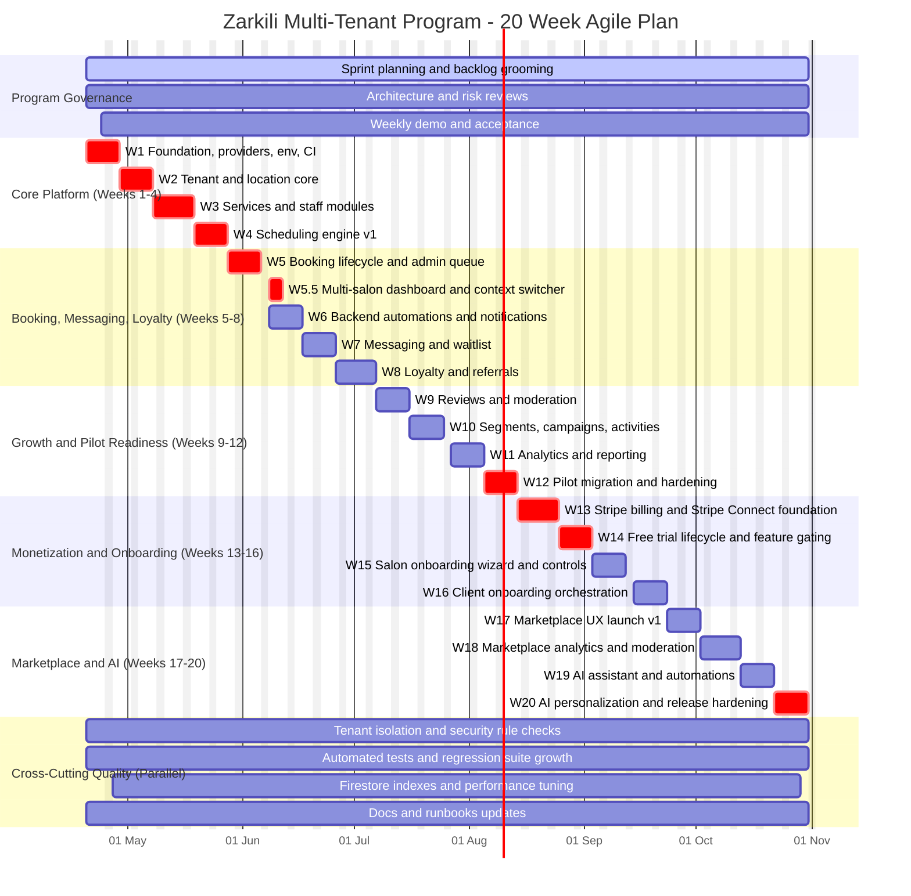

# Project Gantt Plan (Agile, Parallel Streams)

## Purpose
This Gantt chart gives an execution order and parallelization map for the full 20-week program.
It is not strict waterfall. Streams run in parallel, with dependency points and quality gates.

Assumptions:
- Week 1 start: 2026-04-20
- Weekly sprint cadence
- Continuous integration, security checks, and documentation updates throughout

## Mermaid Gantt Chart

## How to Use With Agile Delivery
1. Treat each week block as a sprint primary objective, not a hard phase gate.
2. Pull secondary tasks in parallel from the tracking board when capacity allows.
3. Keep max 2 to 3 cards in In Progress per stream to limit context switching.
4. Re-baseline dates after each sprint review if scope shifts.

## Dependency Highlights
1. Core platform (Weeks 1-4) is a prerequisite for everything else.
2. Stripe and gating (Weeks 13-14) must finish before full monetized rollout.
3. Marketplace launch (Week 17) should precede AI personalization (Weeks 19-20).
4. Security, QA, and docs remain continuous and release-critical.

## Trello Sync Code Legend
Card titles in Trello now use this prefix format:
- [W##-CAT-###] Task title

Examples:
- [W01-ARCH-001] ...
- [W13-PAY-004] ...
- [W19-AI-002] ...

Category code map:
- ARCH: Architecture
- BE: Backend
- FE: Frontend
- FB: Firebase
- SEC: Security
- QA: QA
- OPS: DevOps
- PAY: Payments
- ONB: Onboarding
- MKT: Marketplace
- AI: AI
- LOY: Loyalty
- DOC: Documentation
- GEN: General

Automation script used:
- scripts/trello-gantt-prefix-sync.ps1
