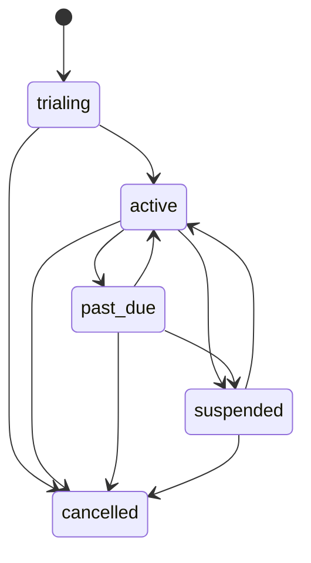

# Tenant Users Domain (Week 2.2)

## Purpose
`tenantUsers` defines tenant membership, role authorization baseline, and subscription metadata foundation.

## Model fields
Implemented in `src/domains/tenants/tenantUsersModel.ts`.

Top-level:
- `membershipId`
- `tenantId`
- `userId`
- `role`
- `permissions`
- `status`
- `subscription`
- `createdAt`
- `updatedAt`

Role enum:
- `tenant_owner`
- `tenant_admin`
- `location_manager`
- `technician`
- `client`

Subscription fields:
- `tier` (`starter | professional | enterprise`)
- `status` (`trialing | active | past_due | suspended | cancelled`)
- `billingCycle` (`monthly | annual`)
- `startDate`
- `trialEndsAt`
- `nextBillingDate`
- `suspendedAt`
- `suspensionReason`

## Repository API
Implemented in `src/domains/tenants/tenantUsersRepository.ts`.

- `assignUserToTenant(membershipId, input)`
- `updateTenantUserRole(membershipId, { actorRole, nextRole })`
- `listTenantUsers(tenantId)`
- `getUserTenantRoles(userId)`

## Role transition matrix (v1)

Legend:
- ✅ allowed
- ❌ blocked

### Actor = tenant_owner
- any current role -> any other role: ✅
- same role -> same role: ❌ (no-op transition blocked)

### Actor = tenant_admin
- current tenant_owner -> any: ❌
- any current role -> next tenant_owner: ❌
- other role changes (non-owner targets): ✅
- same role -> same role: ❌

### Actor = location_manager / technician / client
- any role change: ❌

## Subscription validation rules
- `tier`, `status`, and `billingCycle` must be in allowed enums.
- `startDate` is required.
- `trialing` requires `trialEndsAt`.
- `active` and `past_due` require `nextBillingDate`.
- `suspended` requires both `suspendedAt` and `suspensionReason`.

## Subscription state diagram

## Tests
- `src/domains/tenants/__tests__/tenantUsersRepository.test.ts`
  - subscription shape validation cases
  - role transition guard cases
  - tenant and user query behavior

## Notes
- Subscription fields are validated but not used for feature gating yet.
- Billing enforcement logic will be connected in Stripe integration milestones.
